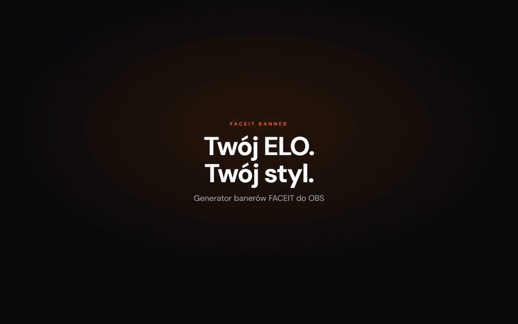
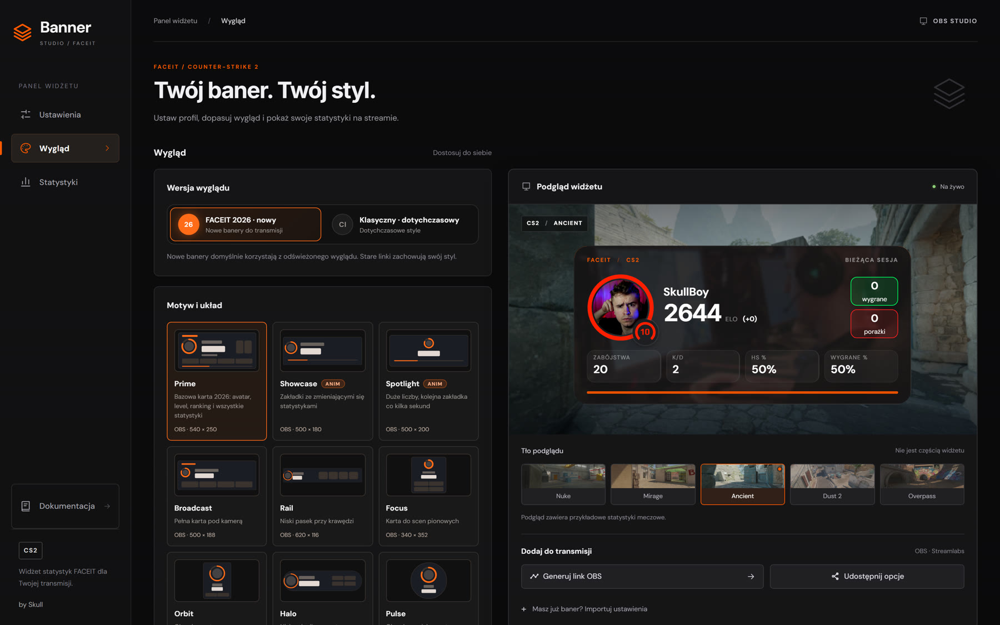
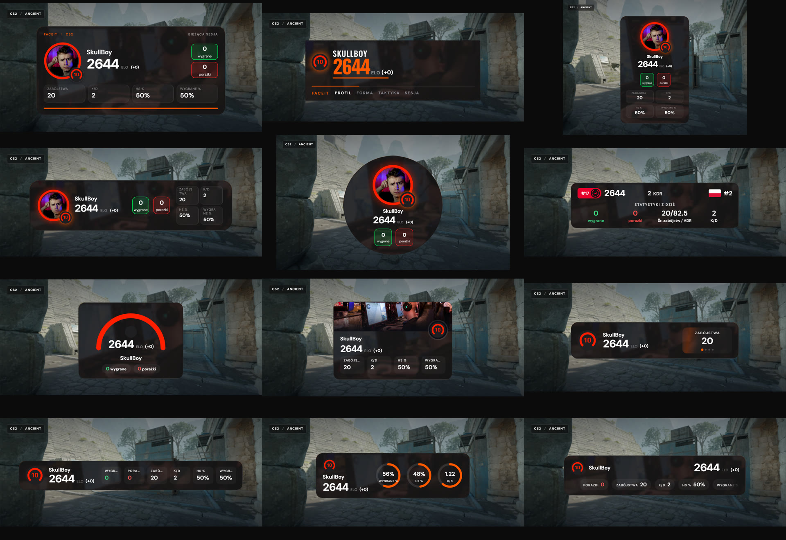
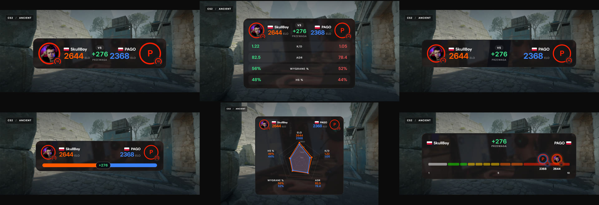
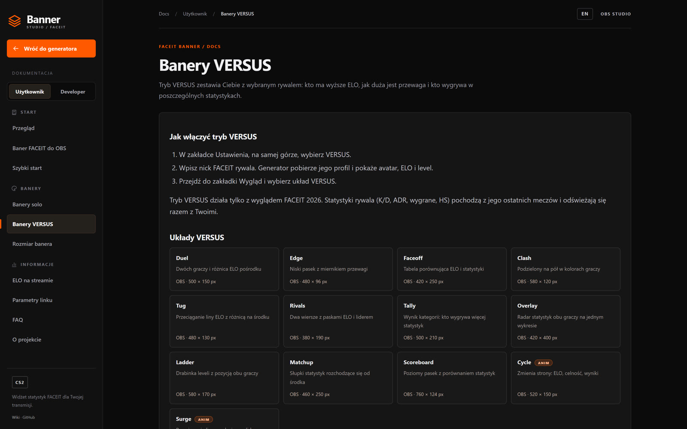

<div align="center">



# FACEIT Banner Studio

**Twój ELO. Twój styl.** Generator banerów i widżetów FACEIT do OBS Studio i Streamlabs.

[](https://faceitbanner.vxh.pl/)
[](https://faceitbanner.vxh.pl/docs/)
[](./LICENSE)

[Otwórz generator](https://faceitbanner.vxh.pl/) · [Dokumentacja](https://faceitbanner.vxh.pl/docs/) · [Dla developerów](https://faceitbanner.vxh.pl/docs/dev/) · [Nagranie (MP4)](.github/assets/demo.mp4)

</div>

---

## Co to jest

Level, ELO, zmiana ELO, wygrane i porażki oraz statystyki z ostatnich meczów CS2 na Twoim streamie, w kilkunastu układach do wyboru. Wpisujesz nick, wybierasz wygląd, kopiujesz link i wklejasz go w OBS jako źródło **Browser**. Bez wtyczek, bez konta, za darmo.

Projekt **nie jest powiązany** z [FACEIT](https://faceit.com).

## Od oryginału do własnej drogi

Baza tego repozytorium to świetny [**faceit-stats-widget** autorstwa mxgic1337](https://github.com/mxgic1337/faceit-stats-widget) (MIT), i ten fundament nadal tu jest: klasyczne style żyją w wyglądzie **Klasyczny**, a licencja i atrybucja oryginału są zachowane. Od tamtej pory projekt poszedł **bardzo daleko dalej** i jest dziś osobnym, mocno rozbudowanym produktem.

| Obszar | Co dodano w tej wersji |
|---|---|
| Wygląd | nowy wygląd **FACEIT 2026** z **18 układami solo**; klasyczne style z bazy zostały jako wygląd **Klasyczny** |
| Tryby | tryb **VERSUS**: Ty kontra rywal, **13 układów** (różnica ELO, porównanie statystyk, radar, drabinka leveli) |
| Animacje | animowane układy: zakładki, rolka statystyk, taśma, tug of war, zmieniające się strony statystyk |
| Rozmiar | **AUTO / Zalecane / Ręcznie**, limity per baner, responsywny układ, Pulse zawsze 1:1 |
| Generator | przebudowane **Studio**: miniatury układów, podgląd na żywo, kolor akcentu, zaokrąglenie rogów |
| Sesja | poprawiony zapis sesji w danych przeglądarki OBS: po restarcie wraca przez 2 godziny, potem liczy od zera |
| Dokumentacja | pełna [dokumentacja](https://faceitbanner.vxh.pl/docs/) **USER / DEV**, PL i EN, renderowana do HTML (SSR), z sitemapą i `llms.txt` |

## Galeria

<div align="center">



**Banery solo**



**Tryb VERSUS**



</div>

## Najważniejsze funkcje

- **18 układów solo** w wyglądzie FACEIT 2026: Prime (bazowy), Showcase, Spotlight, Broadcast, Rail, Focus, Orbit, Halo, Pulse, Ticker, Slab, Gauge, Card, Reel, Ribbon, Tower, Dials, Marquee.
- **13 układów VERSUS**: Duel, Edge, Faceoff, Clash, Tug, Rivals, Tally, Overlay, Ladder, Matchup, Scoreboard, Cycle, Surge. Rywala wpisujesz nickiem, a widżet pobiera jego dane na żywo.
- **Rozmiar banera** w trzech trybach: AUTO dopasowuje do okna OBS, Zalecane daje rozmiar projektowy i skraca baner, gdy ukryjesz elementy, Ręcznie ustawia własne wartości w granicach limitów.
- **Pełna kontrola**: level, ranking regionu i kraju, ikona Challenger, znaczek weryfikacji, pasek postępu ELO, wybór czterech statystyk, poświata levelu, kolory, czcionki.
- **Stan sesji** przetrwa restart OBS (do 2 godzin od zamknięcia widżetu).
- Teksty interfejsu po **polsku, angielsku i niemiecku**.

## Szybki start

1. Otwórz [generator](https://faceitbanner.vxh.pl/) i wpisz nick FACEIT.
2. W zakładce **Wygląd** wybierz układ (domyślnie Prime).
3. Kliknij **Generuj link OBS** i skopiuj adres.
4. W OBS dodaj źródło **Przeglądarka (Browser)**, wklej adres i ustaw rozmiar z karty układu.

Pełny opis krok po kroku: [Baner FACEIT do OBS](https://faceitbanner.vxh.pl/docs/baner-faceit-do-obs/).

## Dokumentacja

<div align="center">



</div>

Dokumentacja jest podzielona na część dla **użytkownika** (szybki start, wszystkie banery, rozmiar, parametry linku, FAQ) i dla **developera** (architektura, uruchomienie, system ustawień, dodawanie układu, działanie widżetu, wdrożenie). Dostępna po polsku i angielsku: [faceitbanner.vxh.pl/docs](https://faceitbanner.vxh.pl/docs/).

## Dla developerów

```bash
corepack enable
pnpm install
cp .env.example .env   # ustaw VITE_FACEIT_API_KEY
pnpm dev               # http://localhost:5173
```

| Polecenie | Co robi |
|---|---|
| `pnpm dev` | serwer deweloperski Vite |
| `pnpm docs` | renderuje dokumentację (SSR), sitemapę i `llms.txt` do `public/` |
| `pnpm build` | sprawdzenie typów, render dokumentacji i build produkcyjny |
| `pnpm lint` / `pnpm format` | ESLint / Prettier |

Jak dodać nowy układ banera: [Nowy układ banera](https://faceitbanner.vxh.pl/docs/dev/nowy-uklad/).

### Stack technologiczny

| Warstwa | Technologia |
|--------|-------------|
| UI | **React 18** + **TypeScript** (strict) |
| Routing | **react-router-dom** |
| Bundler / dev server | **Vite 7** (`@vitejs/plugin-react-swc`) |
| Style | **Less** |
| Dokumentacja | React SSR do statycznego HTML (`vite build --ssr`) |
| Pakiety | **pnpm** |
| Wdrożenie | Docker (node + nginx), CapRover |

## Pochodzenie i licencja

To repozytorium jest **pochodną** (fork z dużymi modyfikacjami) projektu [**mxgic1337/faceit-stats-widget**](https://github.com/mxgic1337/faceit-stats-widget), udostępnionego na licencji [**MIT**](https://github.com/mxgic1337/faceit-stats-widget/blob/main/LICENSE).

Zgodnie z MIT, w dystrybucji zachowujemy oryginalne informacje o prawach autorskich i licencji. Pełny tekst licencji (łącznie z atrybucją oryginału i modyfikacji) znajduje się w pliku [LICENSE](./LICENSE).

| | |
|---|---|
| Oryginał | [github.com/mxgic1337/faceit-stats-widget](https://github.com/mxgic1337/faceit-stats-widget) |
| Ta wersja | [github.com/skullboypl/faceit-banner-faceitbanner.vxh.pl](https://github.com/skullboypl/faceit-banner-faceitbanner.vxh.pl) |
| Autor modyfikacji | [Skull](https://github.com/skullboypl) |

<div align="center">

Zrobione przez [Skull](https://github.com/skullboypl) · [Twitch](https://www.twitch.tv/skullboypl) · [faceitbanner.vxh.pl](https://faceitbanner.vxh.pl/)

</div>
